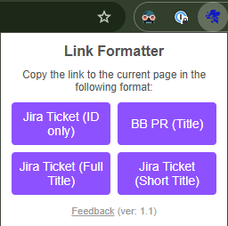

# Chrome Link Formatter

A lightweight Chrome extension that copies the Jira page titles in **Slack-friendly** markup. It automatically sanitizes special characters so your links don’t break the target format.  

## Features

## Installation

1. **Clone or download** this repository.
2. Go to `chrome://extensions/` in Google Chrome.
3. Enable **Developer Mode** (toggle in the top-right corner).
4. Click **Load unpacked** and select the folder containing `manifest.json`.

The extension should now appear in your toolbar. Pin it for quick access.

## Usage

1. Open a Jira Ticket/Bitbucket PR in Chrome.
2. Click the **Chrome Link Formatter** icon.
3. Choose the format you need:
   - **Slack ID** format: `[Jira Ticket ID number](URL)`
   - **Bitbucket PR Title** format: `[Title](URL)` -- The title can be read after the page has loaded, so takes a second to work
   - **Slack** → copies `[Title](URL)`
   - **Slack Short** → copies `[ShortTitle](URL)` (truncated to 35 chars)
4. Copy links, paste in Slack, hit Ctrl+Shift+F
5. Profit

## Support / Contact
schek.it@gmail.com <- This repo cloned from https://github.com/sergey-chek/chrome-link-formatter

Feel free to use this project as you see fit. Contributions are welcome!
